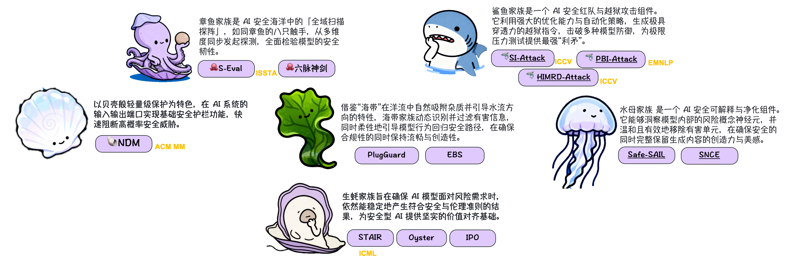

## Hi there 👋 这里是Alibaba AAIG  🌊

AI是承载文明的陆地，是文发展的基石，它**坚实、可见，代表着生产力、创造力和可能性**；AI安全则是**定义其边界的海洋，深邃且充满未知**。它**包围、渗透并塑造着陆地，既孕育信任的航道，也暗藏失控的风暴**。 
我们致力于在人工智能的广阔海洋中，构建安全、可靠、可信赖的技术防线，探索AI安全的深远边界，为智能技术的可持续发展护航。
 > 🌊 安全不是高墙铁壁，而是如海洋般拥有自净化、自适应、自修复能力的有机生态。

## 🐠 安全生态组件
在我们的安全生态中，每个技术模块以海洋生物命名，寓意它们在生态中的角色和特性，让复杂的安全功能更易理解与记忆。
`

### 📦 当前成员一览

| 名称 & 链接 | 海洋寓意 | 技术功能类别 | 简介 |
|-------------|----------|--------------|------|
| [**🦪 Oysters Family**](https://github.com/Alibaba-AAIG/Oysters-Family) | 牡蛎——砂砾进珍珠出 | 安全对齐技术 | 风险的输入，经过先进的对齐技术，产出高质量、符合价值观的 AI 输出 |
| [**🐚 Shells Family**](https://github.com/Alibaba-AAIG/Shells-Family) | 贝壳——轻量级保护 | 基础护栏 | 在输入与输出的第一道关口进行简单、快速的安全阻拦 |
| [**🌿 Kelp Family**](https://github.com/Alibaba-AAIG/Kelp-Family) | 海带——过滤与引导 | 高阶过滤 / 引导 | 动态地过滤内容并引导模型行为至安全路径 |
| [**🐙 Octopus Family**](https://github.com/Alibaba-AAIG/Octopus-Family) | 章鱼——八爪多面探测 | 测试套件 | 构建多维安全评测体系，全面检验模型的安全韧性 |
| [**🦈 Sharks Family**](https://github.com/Alibaba-AAIG/Shark-Family) | 鲨鱼——顶级掠食者 | 越狱攻击工具包 | 精准挖掘模型不同的潜在安全漏洞 |
| [**🪼Jellyfish Family**](https://github.com/Alibaba-AAIG/Jellyfish-Family) | 水母——透明可视化 | 模型可解释性框架 | 洞察模型内部的风险概念,精细化地抑制或擦除模型中可能导致不安全行为的特定神经元 |
| [**你的创意**]	| ~	|  ~ |  ~ |

## 🐋 为何成为这片海域的「开拓者」？
- 破解最前沿的安全困局

直面AI时代的未知风险：提示注入、对齐失控、伦理黑洞... 这里没有标准回答，等你来创造！

- 创造属于自己的「海洋生物」

用PR为安全组件命名：从[水母神经元解释器]到[八爪鱼评测平台]，你的创意将永驻AI安全史！

- 大厂背书 × 社区自治

优质方案将被收录至[**《AI安全白皮书》**](https://s.alibaba.com/cn/WhitePaperHome)并署名发布。

## 🤝 欢迎加入与贡献
我们正在构建AI安全的海洋生态——每个贡献者都是不可或缺的共生体
我们相信，AI 安全应该是开放、协作、充满创造力的。  
无论是创意、代码还是建议，你的参与都能让我们的生态更丰富、更稳健。
- ⭐ **Star** 仓库，获取最新动态  
- 🍴 **Fork** 仓库，构建你自己的海洋组件  
- 🔄 **Pull Request**，为生态添加新的“海洋生物”  
- 💡 分享风险案例、提出安全方案、设计新的海洋风格安全工具

## 联系我们

- 📧 Email: aaig-safety@alibaba.com
- 💬 讨论区：
  

> 🌊 *单个水滴或许无法改变海洋，但无数水滴正在重塑浪花的方向*  
> **Alibaba AAIG** — 先进的安全守护先进的智能。

Alibaba AAIG @ 2025 - Open Source under MIT License  
<!--

**Here are some ideas to get you started:**

🙋‍♀️ A short introduction - what is your organization all about?
🌈 Contribution guidelines - how can the community get involved?
👩‍💻 Useful resources - where can the community find your docs? Is there anything else the community should know?
🍿 Fun facts - what does your team eat for breakfast?
🧙 Remember, you can do mighty things with the power of [Markdown](https://docs.github.com/github/writing-on-github/getting-started-with-writing-and-formatting-on-github/basic-writing-and-formatting-syntax)
-->
