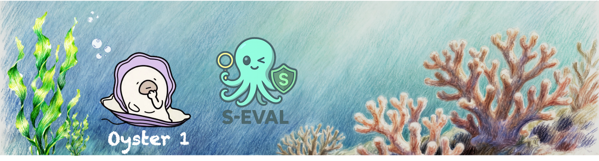

## Hi there 👋 这里是Alibaba AAIG 

我们致力于在人工智能的广阔海洋中，构建安全、可靠、可信赖的技术防线，探索AI安全的深远边界，为智能技术的可持续发展护航。
 🌊 安全不是高墙铁壁，而是如海洋般拥有自净化、自适应、自修复能力的有机生态。

## 🐠 安全生态组件
在我们的安全生态中，每个技术模块以海洋生物命名，寓意它们在生态中的角色和特性，让复杂的安全功能更易理解与记忆。
`

### 📦 当前成员一览

| 名称 & 链接 | 海洋寓意 | 技术功能类别 | 简介 |
|-------------|----------|--------------|------|
| [**🦪 Oyster**](https://github.com/Alibaba-AAIG/Oyster) | 牡蛎——砂砾进珍珠出 | AI 对齐模型 | 从原始与复杂的需求出发，产出高质量、符合价值观的 AI 输出 |
| [**🐚 Shells**](https://github.com/alibaba-aaig/shells) | 贝壳——轻量级保护 | 基础护栏 | 在输入与输出的第一道关口进行简单、快速的安全阻拦 |
| [**🌿 Kelp**](https://github.com/alibaba-aaig/seaweed) | 海带——过滤与引导 | 高阶过滤 / 引导 | 动态地过滤内容并引导模型行为至安全路径 |
| [**🐙 Octopus**](https://github.com/Alibaba-AAIG/Octopus) | 章鱼——八爪多面探测 | 攻击测试套件 | 多维度模拟各种攻击类型，全面检验模型的安全韧性 |

## 🤝 欢迎加入与贡献
我们正在构建AI安全的海洋生态——每个贡献者都是不可或缺的共生体
我们相信，AI 安全应该是开放、协作、充满创造力的。  
无论是创意、代码还是建议，你的参与都能让我们的生态更丰富、更稳健。
- ⭐ **Star** 仓库，获取最新动态  
- 🍴 **Fork** 仓库，构建你自己的海洋组件  
- 🔄 **Pull Request**，为生态添加新的“海洋生物” 
- 💡 分享风险案例、提出安全方案、设计新的海洋风格安全工具

## 联系我们

- 📧 Email: aaig-safety@alibaba.com
- 🐦 Twitter: [@AlibabaAIIG](your_twitter)
- 💬 讨论区：[GitHub Discussions](link)

> 🌊 *智海无涯，共筑安全灯塔*  
> **Alibaba AAIG** — 海洋生态式 AI 安全，共建可信赖的智能世界

Alibaba AAIG @ 2025 - Open Source under MIT License  
<!--

**Here are some ideas to get you started:**

🙋‍♀️ A short introduction - what is your organization all about?
🌈 Contribution guidelines - how can the community get involved?
👩‍💻 Useful resources - where can the community find your docs? Is there anything else the community should know?
🍿 Fun facts - what does your team eat for breakfast?
🧙 Remember, you can do mighty things with the power of [Markdown](https://docs.github.com/github/writing-on-github/getting-started-with-writing-and-formatting-on-github/basic-writing-and-formatting-syntax)
-->
